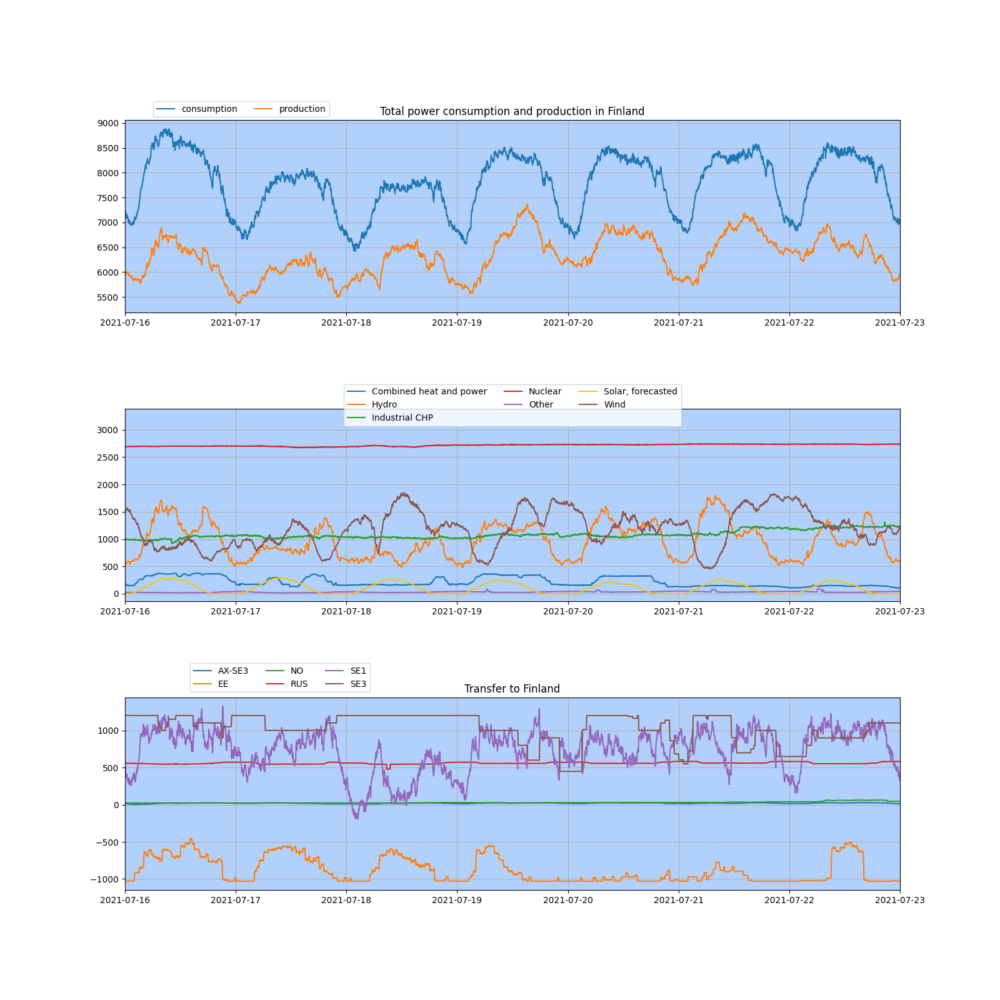

# Fingrid_requests_python

A simple script offering a ready mean to access the real time data
from the finnish transmission system operator, Fingrid.

-----
## Example command and output
```
$ python3 fetch.py -e 2021-07-23 -d 7
Absolute production GWh:
{'Combined heat and power': 36.39, 'Hydro': 162.8, 'Industrial CHP': 181.69, 'Nuclear': 456.02, 'Other': 5.37, 'Solar, forecasted': 17.94, 'Wind': 196.35}
Percentage of total power produced in Finland
{'Combined heat and power': 3.4, 'Hydro': 15.4, 'Industrial CHP': 17.2, 'Nuclear': 43.2, 'Other': 0.5, 'Solar, forecasted': 1.7, 'Wind': 18.6}
```

