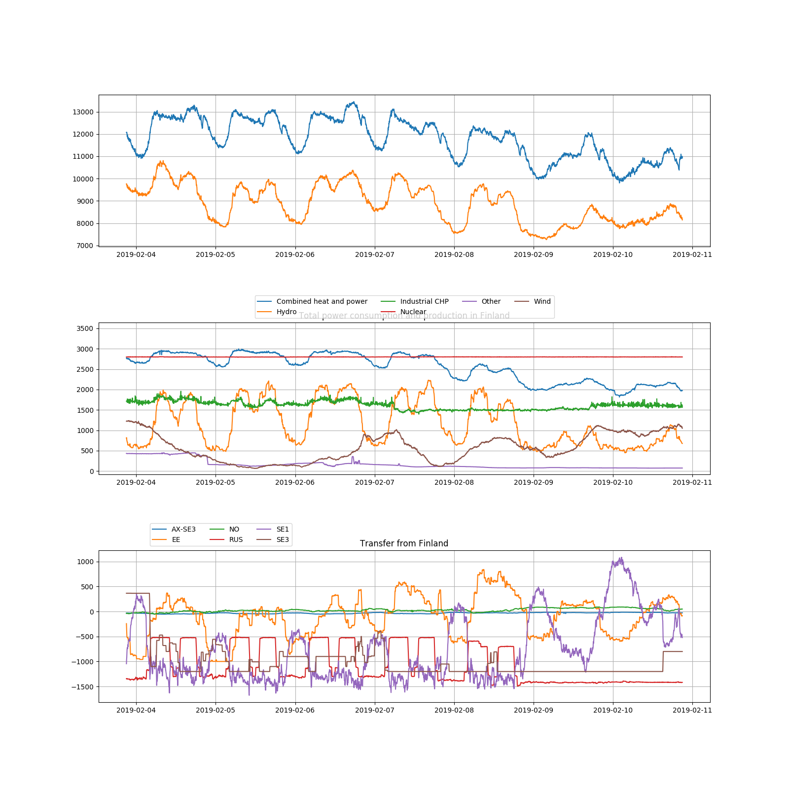

# Fingrid_requests_python

A simple script offering a ready mean to access the real time data
from the finnish transmission system operator, Fingrid.

-----
## Example command and output
```
$ python3 fetch.py -e 2019-02-11 -d 7
Absolute production GWh:
{'Combined heat and power': 426.91, 'Hydro': 197.08, 'Industrial CHP': 270.98, 'Nuclear': 470.36, 'Other': 27.3, 'Wind': 96.41}
Percentage of total power produced in Finland
{'Combined heat and power': 28.7, 'Hydro': 13.2, 'Industrial CHP': 18.2, 'Nuclear': 31.6, 'Other': 1.8, 'Wind': 6.5}
```

